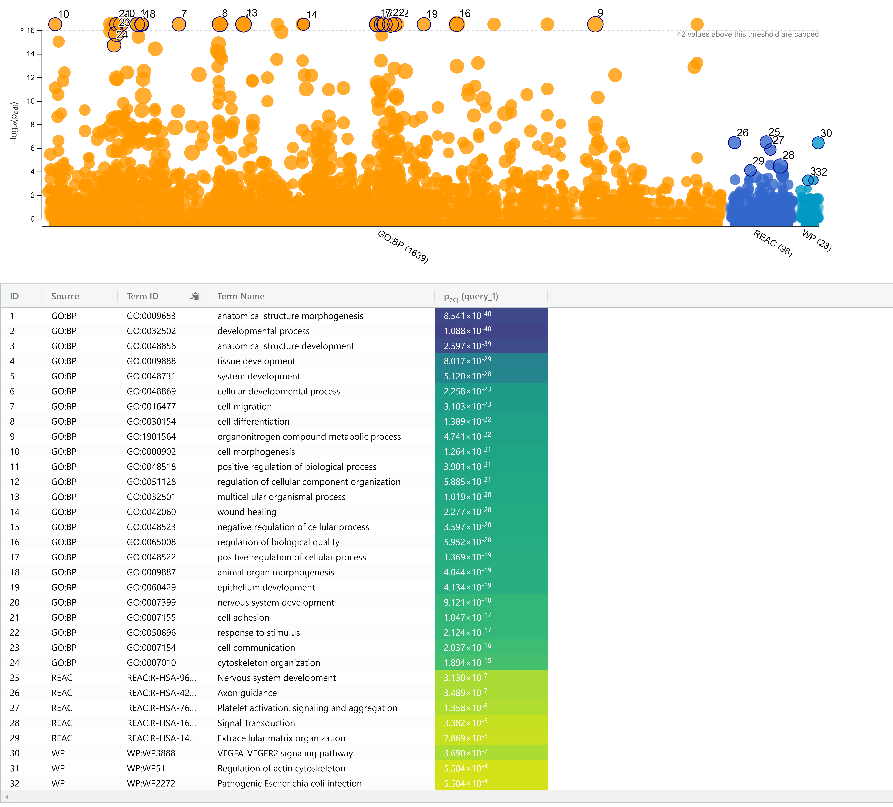
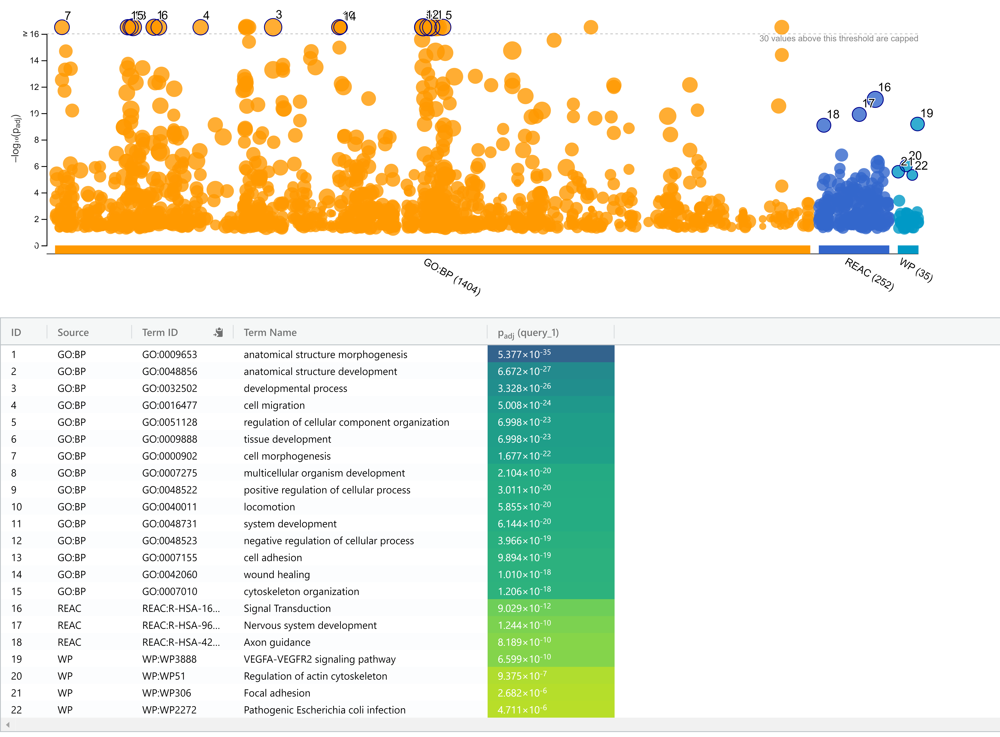
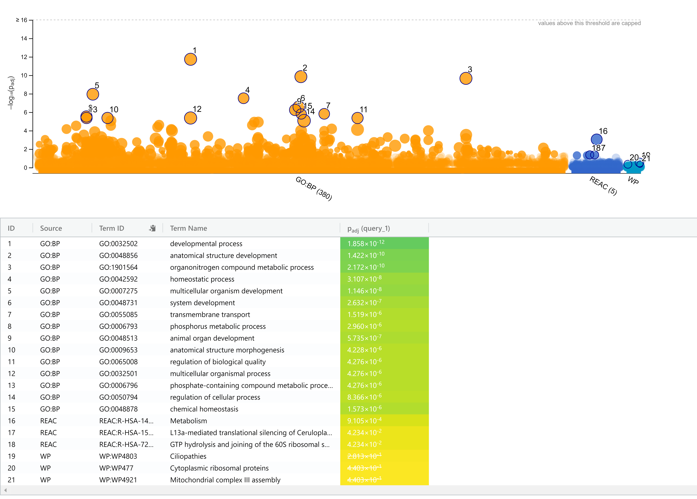

# Introduction and preparation

In Assignment 1, we began processing the GEO dataset GSE157852: this is a bulk RNA-seq dataset from the paper, "Human Pluripotent Stem Cell-Derived Neural Cells and Brain Organoids Reveal SARS-CoV-2 Neurotropism Predominates in Choroid Plexus Epithelium" by @jacob2020human. The transcriptome analysis in this paper studies the effects of SARS-CoV-2 infection on gene expression in choroid plexus organoids (CPOs). CPOs underwent 2 treatments (either mock control or SARS-CoV-2 exposure). The mock group was analyzed at 72 hours post-infection (hpi), while the virus-exposed group was analyzed at 2 timepoints, 24 and 72 hpi. There are thus 3 groups (Mock_72hpi, SARS-CoV-2_24hpi, and SARS-CoV-2_72hpi) of 3 samples each, making the total sample size 9. The dataset contains raw gene counts of 29,755 genes, represented by HUGO gene symbols. After filtering out weakly expressed and non-informative features, the dataset includes 12,929 genes. 

We then normalized the data via Trimmed Mean of M-values (TMM) normalization, which assumes that most genes are not differentially expressed, and that there are a similar number of up- and down- regulated genes in the data across samples. The boxplots, density distributions, and multidimensional scaling (MDS) plots showed noticeable, but not drastic, improvement in similarity between samples, and clustering of samples within the same group. Finally, we saved the normalized gene counts as a CSV file, which we will now work with in Assignment 2 to conduct differential gene expression and over-representation analysis (ORA).


## Installing packages

```{r eval = TRUE, message = FALSE, warning = FALSE}
if (!requireNamespace("BiocManager", quietly = TRUE)){
  install.packages("BiocManager")}
if (!requireNamespace("edgeR", quietly = TRUE)){
  BiocManager::install("edgeR")}
if (!requireNamespace("ComplexHeatmap", quietly = TRUE)){
  BiocManager::install("ComplexHeatmap")}
if (! requireNamespace("limma", quietly = TRUE)){
  BiocManager::install("limma")}
if (!requireNamespace("knitr", quietly = TRUE)){
  install.packages("knitr")}
if (!requireNamespace("circlize", quietly = TRUE)){
  install.packages("circlize")}
```

## Loading normalized dataset
First, we will load the normalized gene counts from Assignment 1, which was saved as the file "normalized_gene_counts.csv".
```{r eval = TRUE, message = FALSE, warning = FALSE}
normalized_gene_counts <- read.table(file = file.path(getwd(), 
                          "Data/normalized_gene_counts.csv"), header = TRUE, 
                          sep = ",", stringsAsFactors = TRUE, check.names = FALSE)

# Show the first 5 rows
knitr::kable(normalized_gene_counts[1:5, 1:10], type = "html")
```

**Figure 1. Gene count dataset (first 5 rows shown).** The dataset
contains gene counts for 9 samples across
12,929 unique genes. Each sample column name specifies its treatment and time of analysis,
followed by sample number (1 through 9).

Upon inspection we noticed that the gene counts appear to be filtered raw counts instead
of the normalized data. After reviewing Assignment 1 we found that this is 
due to the conversion of a DGEList object (which stored the calculated
normalization factors and raw counts separately) not being saved as the
normalized counts. We will simply re-calculate the normalization here:

```{r eval = TRUE, message = FALSE, warning = FALSE}
# Since the first column is currently unnamed, name it
colnames(normalized_gene_counts)[1] <- "HGNC_symbol"

# The following code is copied from Assignment 1.

# Extract the part of column names between "CPO_" and "_S"
samples <- data.frame(lapply(colnames(normalized_gene_counts)[2:10], 
                      function(x){gsub(".*CPO_|_S.*", "", x)}))
colnames(samples) <- colnames(normalized_gene_counts)[2:10]
rownames(samples) <- c("treatment_time")
samples <- data.frame(t(samples)) 

raw_matrix <- as.matrix(normalized_gene_counts[, 2:10])
rownames(raw_matrix) <- normalized_gene_counts$HGNC_symbol
colnames(raw_matrix) <- colnames(normalized_gene_counts)[2:10]

# Create DGEList object
d = edgeR::DGEList(counts = raw_matrix, group = samples$treatment_time)
d <- edgeR::calcNormFactors(d)

# Store normalized counts in counts per million (cpm)
normalized_gene_counts[, 2:10] <- edgeR::cpm(d)
```


## Initial heatmap

A heatmap represents numbers using colours relative to a defined scale legend, and clusters genes with similar counts and
samples with similar gene expression among the genes. This allows us to visualize the initial data 
across genes and across samples.

```{r eval = TRUE, message = FALSE, warning = FALSE}
heatmap_matrix <- normalized_gene_counts[, 2:10]
rownames(heatmap_matrix) <- normalized_gene_counts$HGNC_symbol
colnames(heatmap_matrix) <- colnames(normalized_gene_counts[, 2:10])

# Scale across each gene by row normalization
heatmap_matrix <- t(scale(t(heatmap_matrix)))

if (min(heatmap_matrix) == 0) {
   heatmap_col = circlize::colorRamp2(c( 0, max(heatmap_matrix)),
                           c("white", "red"))
} else {
  heatmap_col = circlize::colorRamp2(c(min(heatmap_matrix), 0,
         max(heatmap_matrix)), c("blue", "white", "red"))
}

initial_heatmap <- ComplexHeatmap::Heatmap(as.matrix(heatmap_matrix),
     show_row_dend = TRUE, show_column_dend = TRUE,
     col=heatmap_col, show_column_names = TRUE,
     show_row_names = FALSE, show_heatmap_legend = TRUE)
initial_heatmap
```

**Figure 2. Heatmap of initial normalized gene counts.** 
There are visible differences in gene expression patterns between the 3 groups.
As we might expect, samples belonging to the same treatment group cluster together, with
SARS-CoV-2_24hpi in between the Mock control and SARS-CoV-2_72hpi groups, 
which appear to be the pair of groups with least similar gene expression. 
There is also noticeable variation at lower levels between replicates
of the same group (e.g. the 3 rightmost samples, S7 to S9).


# Differential gene expression analysis

## Model design
First, we will design a model to be used to calculate differential expression.
We will conduct the analysis using the edgeR package, which is designed
specifically for RNA-seq data (@R-edgeR). The package will allow us to use the quasi-likelihood 
model, which is highly recommended for bulk RNA-seq data. 

### Defining sample groups
As done in Assignment 1, given that the mock treatment group only has one time point, it would be most meaningful to compare
the data between the 3 predefined groups.
So, we will associate each sample with one of the 3 treatment_time groups:
Mock_72hpi, SARS-CoV-2_24hpi, and SARS-CoV-2_72hpi.

```{r eval = TRUE, message = FALSE, warning = FALSE}
# Extract the part of column names between "CPO_" and "_S"
samples <- data.frame(lapply(colnames(normalized_gene_counts)[2:10], 
                      function(x){gsub(".*CPO_|_S.*", "", x)}))
colnames(samples) <- colnames(normalized_gene_counts)[2:10]
rownames(samples) <- c("treatment_time")
samples <- data.frame(t(samples))  
knitr::kable(samples, type = "html")
```

**Figure 3. Table of samples and associated treatment_time groups.**


### Model matrix
Following our defined sample groups, there is 1 factor we will account for
in our analysis: treatment group (denoted treatment_time).

```{r}
treatment_time <- factor(samples$treatment_time)
model_design <- model.matrix(~0 + treatment_time)
knitr::kable(model_design, type = "html")
```

**Figure 4. Model design for differential gene expression analysis.**

We will prepare our data for analysis using edgeR which assumes the data has a
negative binomial distribution. So we will first confirm this with 
a biological coefficient of variance (BCV) plot to show the relative variation of expression between replicates.

```{r eval = TRUE, message = FALSE, warning = FALSE}
# Create data matrix
expression_matrix <- as.matrix(normalized_gene_counts[, 2:10])
rownames(expression_matrix) <- normalized_gene_counts$HGNC_symbol
colnames(expression_matrix) <- colnames(normalized_gene_counts)[2:10]

# Create DGEList object
d = edgeR::DGEList(counts = expression_matrix, group = samples$treatment_time)

# Estimate dispersion
d <- edgeR::estimateDisp(d, model_design)
# Plot the mean-variance relationship in BCV
edgeR::plotBCV(d, col.tagwise = "black", col.common = "red")

```

**Figure 5. BCV plot of normalized gene counts showing common and tagwise dispersion.** Genes that are less expressed have higher variation, while genes that are more expressed have lower variation. The data appears to follow a negative binomial distribution as shown by the blue trendline.


Now we can fit the model and calculate differential gene expression.
Since we have 3 groups, we will do a separate comparison for each pairing.
We will use the default option for correction with multiple hypothesis testing:
the Benjamini-Hochberg method. It is commonly used for RNA-seq analysis and sufficiently 
stringent as to not overly limit our results.

```{r eval = TRUE, message = FALSE, warning = FALSE}
# Update column names to valid R names
colnames(model_design) <- c("Mock72hpi", "Virus24hpi", "Virus72hpi")

# Fit the quasi-likelihood model
fit <- edgeR::glmQLFit(d, model_design)
```


### SARS-CoV-2 24hpi vs mock

```{r eval = TRUE, message = FALSE, warning = FALSE}
# Set up the comparison for SARS-CoV-2_24hpi vs mock
contrast_virus24_vs_mock <- limma::makeContrasts(virus24_vs_mock =
                                  "Virus24hpi-Mock72hpi", levels = model_design)

# Calculate differential expression and get top hits for virus 24 hpi vs mock
qlf_virus24_vs_mock <- edgeR::glmQLFTest(fit, 
                             contrast = contrast_virus24_vs_mock)
tt_virus24_vs_mock <- edgeR::topTags(qlf_virus24_vs_mock, n = nrow(d))

knitr::kable(head(tt_virus24_vs_mock), type = "html", digits = 32)
```

**Figure 6. Top hits in SARS-CoV-2_24hpi vs Mock comparison.** The initial p-values and
corrected FDR p-values are shown in the last 2 columns. We will use these to identify
the significantly differentially expressed genes.

(For the following comparisons, we will omit showing the top hits table for brevity.)

We will first use the threshold of p = 0.05. As mentioned in lecture, this threshold
is commonly used as a standard threshold for statistical significance in
differential gene expression analysis.

How many genes passed the threshold of p = 0.05?
```{r eval = TRUE, message = FALSE, warning = FALSE}
length(which(tt_virus24_vs_mock$table$PValue < 0.05))
```

How many genes passed correction?
```{r eval = TRUE, message = FALSE, warning = FALSE}
length(which(tt_virus24_vs_mock$table$FDR < 0.05))
```
This seems to be a good number of genes for analysis. For now we will maintain this
threshold for the following comparisons and adjust the threshold if needed.

### SARS-CoV-2 72hpi vs mock

```{r eval = TRUE, message = FALSE, warning = FALSE}
contrast_virus72_vs_mock <- limma::makeContrasts(virus72_vs_mock = 
                                  "Virus72hpi-Mock72hpi", levels = model_design)

# Calculate differential expression and get top hits for virus_72hpi vs mock
qlf_virus72_vs_mock <- edgeR::glmQLFTest(fit, 
                             contrast = contrast_virus72_vs_mock)
tt_virus72_vs_mock <- edgeR::topTags(qlf_virus72_vs_mock, n = nrow(d))
```

How many genes passed the threshold of p = 0.05?
```{r eval = TRUE, message = FALSE, warning = FALSE}
length(which(tt_virus72_vs_mock$table$PValue < 0.05))
```

How many genes passed correction?
```{r eval = TRUE, message = FALSE, warning = FALSE}
length(which(tt_virus72_vs_mock$table$FDR < 0.05))
```
The number of genes that passed correction in SARS-CoV-2_72hpi vs Mock is higher
than that of SARS-CoV-2_24hpi vs Mock. This aligns with our observations from
the group clustering in the initial heatmap (Fig. 2) and MDS plot (Assignment 1), that SARS-CoV-2_72hpi
has the most drastic differences in gene expression when compared to Mock.

Since this number of differentially expressed genes is quite large, we can try 
lowering the p-value threshold to 0.01. How many genes passed
correction at this threshold?
```{r eval = TRUE, message = FALSE, warning = FALSE}
length(which(tt_virus72_vs_mock$table$FDR < 0.01))
```


### SARS-CoV-2 24hpi vs 72hpi

```{r eval = TRUE, message = FALSE, warning = FALSE}
contrast_virus24_vs_virus72 <- limma::makeContrasts(virus24_vs_virus72 =
                                "Virus24hpi-Virus72hpi", levels = model_design)

# Calculate differential expression and get top hits for virus_24hpi vs virus_72hpi
qlf_virus24_vs_virus72 <- edgeR::glmQLFTest(fit, 
                             contrast = contrast_virus24_vs_virus72)
tt_virus24_vs_virus72 <- edgeR::topTags(qlf_virus24_vs_virus72, n = nrow(d))
```

How many genes passed the threshold of p = 0.05?
```{r eval = TRUE, message = FALSE, warning = FALSE}
length(which(tt_virus24_vs_virus72$table$PValue < 0.05))
```

How many genes passed correction?
```{r eval = TRUE, message = FALSE, warning = FALSE}
length(which(tt_virus24_vs_virus72$table$FDR < 0.05))
```
As expected, the number of genes that passed correction in this contrast is the 
lowest of the 3, suggesting that the 2 virus-exposed groups are most similar
in gene expression.


## Visualizing differential gene expression of SARS-CoV-2 72 hpi vs Mock

Since SARS-CoV-2_72hpi vs Mock is the comparison with the most differentially
expressed genes, we will continue our analysis with the data from this comparison.

### MA plot 
We will plot the differential expression using log ratio on an MA plot to show the difference between two treatment_time groups.

```{r eval = TRUE, message = FALSE, warning = FALSE}
# Get the significantly differentially expressed genes (p-value < 0.01)
MA <- edgeR::decideTestsDGE(qlf_virus72_vs_mock, adjust.method = "BH", p.value = 0.01)
# Use the edgeR function plotMD - MD plot is the same as MA plot
edgeR::plotMD.DGEExact(qlf_virus72_vs_mock, status = MA, main = " ", 
                       xlab = "Average log counts per million (logCPM)", 
                       ylab = "Log fold change (logFC)")
```

**Figure 7. MA plot of SARS-CoV-2_72hpi vs Mock gene expression.**
The distributions of differentially expressed genes are distinct from the 
rest of the genes (black).
Up-regulated genes (red) have overall higher log fold change magnitude than the
down-regulated genes (blue), with several up-regulated genes that are significantly more expressed at the top right
region of the plot.


### Heatmap of top hits
Now that we can isolate the most significantly up- and down-regulated genes,
we can again visualize their differential expression among the samples and groups
using a heatmap.

```{r eval = TRUE, message = FALSE, warning = FALSE}
# Get normalized counts
normalized_counts <- log2(edgeR::cpm(d) +1)
# Create the scaled heatmap object
heatmap_matrix <- normalized_counts
top_hits <- rownames(tt_virus72_vs_mock)[which(tt_virus72_vs_mock$table$FDR < 0.01)]

# Scale by row normalization and store the top hits in a matrix
heatmap_matrix_tophits <- t(
  scale(t(heatmap_matrix[which(rownames(heatmap_matrix) %in% top_hits),]))) 

if(min(heatmap_matrix_tophits) == 0){
    heatmap_col = circlize::colorRamp2(c( 0, max(heatmap_matrix_tophits)), 
                             c( "white", "red"))
} else {
    heatmap_col = circlize::colorRamp2(c(min(heatmap_matrix_tophits), 0,
                  max(heatmap_matrix_tophits)), c("blue", "white", "red"))
}

# Annotate the heatmap with treatment_time groups as the sample type
ha_colours <- c("darkgreen", "blue", "purple")
names(ha_colours) <- unique(samples$treatment_time)
ha <- ComplexHeatmap::HeatmapAnnotation(df=data.frame(
  type = samples$treatment_time),
  col = list(type = ha_colours))
current_heatmap <- ComplexHeatmap::Heatmap(as.matrix(heatmap_matrix_tophits),
                  cluster_rows = TRUE, show_row_dend = TRUE,
                  cluster_columns = TRUE,show_column_dend = FALSE,
                  col=heatmap_col, show_column_names = FALSE, 
                  show_row_names = FALSE, show_heatmap_legend = TRUE,
                  top_annotation = ha)
current_heatmap
```

**Figure 8. Heatmap of top gene hits from the SARS-CoV-2 vs Mock comparison.**
The type annotation clearly shows that the samples of each treatment_time 
group cluster together.
Overall, genes that are up-regulated (red) in the mock control are likely to be down-regulated (blue)
in SARS-CoV-2_72hpi samples, and vice versa. The differences in gene expression
between the mock control and SARS-CoV-2_24hpi are at a more moderate level. 
The sets of up- and down-regulated genes are most similar between the two 
SARS-CoV-2 groups.


# Thresholded over-representation analysis (ORA)
We can obtain the significantly up- and down-regulated genes, then run a thresholded
over-representation analysis to observe the genes' associated processes and pathways.

## Thresholded list of genes

Since the SARS-CoV-2_72hpi vs Mock comparison had the largest number of differentially 
expressed genes that passed correction, we will use the top hits
to get our thresholded list of genes, as we are interested in the strongest
signals in differential gene expression associated with exposure to the virus.

```{r eval = TRUE, message = FALSE, warning = FALSE}
# Merge gene names with the top hits
qlf_output_hits_withgn <- merge(normalized_gene_counts$HGNC_symbol, qlf_virus72_vs_mock, by.x=1, by.y = 0)
colnames(qlf_output_hits_withgn)[1] <- "HGNC_symbol"
# Get ranking of top hits from most up-regulated to most down-regulated
qlf_output_hits_withgn[,"rank"] <- -log(qlf_output_hits_withgn$PValue, base = 10) * sign(qlf_output_hits_withgn$logFC)
qlf_output_hits_withgn <- qlf_output_hits_withgn[order(qlf_output_hits_withgn$rank),]

# Get up-regulated (positive logFC) and down-regulated (negative logFC)
# with p-values that pass the threshold of 0.01
upregulated_genes <- qlf_output_hits_withgn$HGNC_symbol[
  which(qlf_output_hits_withgn$PValue < 0.01 
             & qlf_output_hits_withgn$logFC > 0)]
downregulated_genes <- qlf_output_hits_withgn$HGNC_symbol[
  which(qlf_output_hits_withgn$PValue < 0.01
             & qlf_output_hits_withgn$logFC < 0)]

# Save txt files of up- and down-regulated genes
write.table(x=upregulated_genes,
            file=file.path(getwd(), "Data/SARS_CoV-2_72hpi_upregulated_genes.txt"), sep = "\t",
            row.names = FALSE, col.names = FALSE, quote = FALSE)
write.table(x=downregulated_genes,
            file=file.path(getwd(), "Data/SARS_CoV-2_72hpi_downregulated_genes.txt"), sep = "\t",
            row.names = FALSE, col.names = FALSE, quote = FALSE)
# Save txt file of ranked gene list 
write.table(x=data.frame(genename= qlf_output_hits_withgn$HGNC_symbol, F_stat= qlf_output_hits_withgn$rank),
            file=file.path(getwd(),"Data/SARS_CoV-2_72hpi_ranked_genelist.txt"), sep = "\t",
            row.names = FALSE, col.names = FALSE, quote = FALSE)
```

## Functional profiling with g:Profiler
We will use the gene set analysis tool g:Profiler (@raudvere2019), specifically the functional
profiling feature g:GOSt using the following input and parameters.

Query:
We run one enrichment analysis for the combined up- and down-regulated gene list,
and one analysis each for the up-regulated and down-regulated genes lists.
In each analysis we select all genes in the list for the query input.

Options:

* Organism: Homo sapiens (Human)
* All results
* Significance threshold: Benjamini-Hochberg FDR
* User threshold: 0.05
* Data sources: Gene Ontology (GO) biological process, Reactome, WikiPathways

We again choose BH (FDR) for multiple hypothesis testing, and a user threshold
of 0.05 to yield sufficient amounts of significant results. 
We selected these data sources as we are interested in pathway enrichment,
and we have previously worked with them in this course to get informative results.

For genes that were matched to multiple Ensembl IDs, we chose the 
"Select the Ensembl ID with the most GO annotations (for all; first if the same)" option.

## Geneset enrichment results

### All differentiallly expressed gene enrichment

```{r eval = TRUE, message = FALSE, warning = FALSE}

```

**Figure 9. Differentially expressed genes enrichment results from g:GOSt.**
The Manhattan plot shows the significance levels of enriched terms.
To highlight top terms, 24 GO biological process terms were selected from the top 35, 
avoiding some redundancies to better represent the most enriched process types. 
Top Reactome and WikiPathways terms are also shown. 

Across the data sources, the top enriched terms are most related to development,
cell migration, cell and cytoskeleton organization, inflammatory response, signaling.


### Up-regulated gene enrichment

```{r eval = TRUE, message = FALSE, warning = FALSE}

```

**Figure 10. Up-regulated genes enrichment results from g:GOSt.** The Manhattan plot 
shows the significance levels of enriched terms.
To highlight top terms, 15 GO biological
process terms were selected from the top 20, avoiding some redundancies to better 
represent the most enriched process types. Top Reactome and WikiPathways terms are also shown. 

Across the top terms from the data sources, terms related to
development, cell migration, cytoskeleton organization, and inflammatory response seem to be most common.

### Down-regulated gene enrichment

```{r eval = TRUE, message = FALSE, warning = FALSE}

```
**Figure 11. Down-regulated genes enrichment results from g:GOSt.**
The Manhattan plot produced by g:GOSt shows the significance levels of enriched terms.
To highlight some terms, the top 15 GO biological process terms were selected.
Top Reactome terms are also shown. While there were 0 WikiPathways terms that passed the threshold,
the top results are still shown for interpretation.

Across the top terms from the data sources, terms related to development, homeostasis, membrane transport, and metabolism seem to be the most common.

Interestingly, the up-regulated gene list (Fig. 10) was associated with top terms at 
drastically lower p-values than the the top terms returned for the down-regulated gene 
list (Fig. 11) This suggests that SARS-CoV-2 exposure is associated with stronger signals of
positive regulation for certain genes and pathways compared to signals of negative regulation.

## Disucssion of thresholded ORA

#### Which method did you choose and why?

We used the enrichment analysis tool g:GOSt from g:Profiler (version e108_eg55_p17_0254fbf), which we are familiar
with from lecture material and homework.
It is also useful for our analysis as it integrates many robust data sources, 
has customizable parameters, and easily viewable results.

#### What annotation data did you use and why? What version of the annotation are you using?

Since we are interested in human pathways and processes enriched in the gene lists,
we used the extensive annotation sources, GO: Biological process (version 2022-12-04), 
Reactome (version 82, updated 2022-09-15), and WikiPathways (version 2022-12-27).

#### How many genesets were returned with what thresholds?

At thresholds of 0.05, the following numbers of genesets were returned:

* Up- and down-regulated: 1639 from GO: BP, 98 from REAC, 23 from WP (Fig. 9)
* Up-regulated: 1404 from GO: BP, 252 from REAC, 35 from WP (Fig. 10)
* Down-regulated: 380 from GO: BP, 5 from REAC, 0 from WP (Fig. 11)

#### Run the analysis using the up-regulated set of genes, and the down-regulated set of genes separately. 
#### How do these results compare to using the whole list (i.e all differentially expressed genes together vs. the up-regulated and down regulated differentially expressed genes separately)?

Compared to the down-regulated list, the results using the up-regulated was more similar
to the results found using the whole list, in regards to both the number of
genesets returned and the overall processes related to the top hits. The p-values
were also quite similar between the results from the up-regulated list and from the whole list.
The results from the down-regulated list were less noticeable among the top hits of 
the whole list.

# Interpretation

#### 1. Do the over-representation results support conclusions or mechanism discussed in the original paper?

The ORA results mostly support the conclusions drawn from the analysis in the original paper.
For up-regulated genes, the paper's GO term analysis found enrichment for genes involved in "viral responses, RNA processing, cytokine responses, cytoskeleton rearrangement, and cell death" (@jacob2020human). 
These have overlaps with the common themes we mentioned under Fig. 9 and 10, particularly
on viral/inflammatory response and cytoskeleton organization. 
However, only a few terms related to RNA processing were found in the detailed results, and 
there was only one term clearly related to cell death.

For down-regulated genes, the paper found enrichment for "ion transport, transmembrane transport, cilium, and cell junction" (@jacob2020human). 
These have overlaps with the processes we described under Fig. 11, including homeostasis and membrane transport.
Notably, the WikiPathway term "ciliopathies" refers to "cilium" abnormalities, but this term did
not pass the threshold in our analysis (Fig. 11).

#### 2. Can you find evidence, i.e. publications, to support some of the results that you see. How does this evidence support your results.

The review article "Human Brain Organoids as Models for Central Nervous System Viral Infection" by @Depla2022
reports that multiple studies have found evidence of inflammatory response and cytokine signaling in
SARS-CoV-2-exposed human brain organoids, as well as dysregulated metabolism and impaired secretory function.
This suggests up-regulated genes involved in viral response and down-regulated genes involved in metabolism and membrane transport,
supporting our results.

# References
