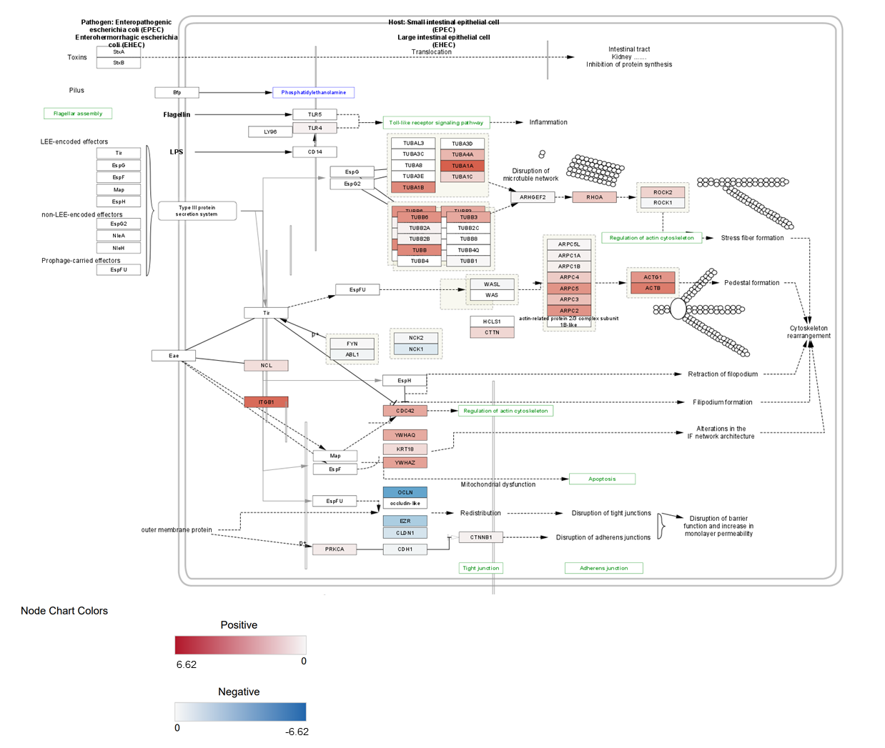

# Introduction and preparation

In Assignment 1, we began processing the GEO dataset GSE157852: this is a bulk RNA-seq dataset from the paper, "Human Pluripotent Stem Cell-Derived Neural Cells and Brain Organoids Reveal SARS-CoV-2 Neurotropism Predominates in Choroid Plexus Epithelium" by @jacob2020human. The transcriptome analysis in this paper studies the effects of SARS-CoV-2 infection on gene expression in choroid plexus organoids (CPOs). CPOs underwent 2 treatments (either mock control or SARS-CoV-2 exposure). The mock group was analyzed at 72 hours post-infection (hpi), while the virus-exposed group was analyzed at 2 timepoints, 24 and 72 hpi. There are thus 3 groups (Mock_72hpi, SARS-CoV-2_24hpi, and SARS-CoV-2_72hpi) of 3 samples each, making the total sample size 9. The dataset contains raw gene counts of 29,755 genes, represented by HUGO gene symbols. After filtering out weakly expressed and non-informative features, the dataset includes 12,929 genes. 

We then normalized the data via Trimmed Mean of M-values (TMM) normalization, which assumes that most genes are not differentially expressed, and that there are a similar number of up- and down- regulated genes in the data across samples. The boxplots, density distributions, and multidimensional scaling (MDS) plots showed noticeable, but not drastic, improvement in similarity between samples, and clustering of samples within the same group. Finally, we saved the normalized gene counts as a CSV file.

In Assignment 2, we used the normalized gene counts to conduct differential gene expression and thresholded over-representation analysis (ORA). We designed a model based on the 3 predefined groups, then, using the edgeR package, calculated differential gene expression between each pair of groups. As expected, the comparison between mock control and SARS-CoV-2_72hpi resulted in the highest number of differentially expressed genes that passed our significance threshold. To continue our analysis with the results from this comparison, we saved the up- and down-regulated gene lists, as well as a ranked gene list, as txt files. We also visualized the differential expression of the top up- and down-regulated genes by producing a heatmap, showing that the mock control and SARS-CoV-2_72hpi groups had the most significant differences in gene expression, while the two virus-exposed groups were most similar. 

Using g:Profiler, we performed thresholded ORA to observe the biological pathway enrichment of the up- and down-regulated gene lists both separately and combined. The up-regulated gene list yielded a greater number of significantly enriched genesets than the down-regulated list. Top enriched genesets for the up-regulated gene list, as opposed to those for the down-regulated gene list, tended to also be more enriched for the combined list. The thresholded ORA results mostly supported the enrichment analysis results from the original paper @jacob2020human. Similar to the paper, our analysis found enrichment of viral/inflammatory response and cytoskeleton organization processes among the up-regulated genes, along with enrichment of homeostasis and membrane transport processes among the down-regulated genes.

Finally, in Assignment 3, we will now use the ranked gene list to conduct non-thresholded gene set enrichment analysis (GSEA), and visualize the results as a network using the Enrichment Map app from Cytoscape.


## Installing packages

```{r eval = TRUE, message = FALSE, warning = FALSE}
if (!requireNamespace("knitr", quietly = TRUE)){
  install.packages("knitr")}
```

# Non-thresholded gene set enrichment analysis

#### What method did you use? What genesets did you use? Make sure to specify versions and cite your methods.

We ran Gene Set Enrichment Analysis (GSEA) 4.3.2 through its desktop graphical interface (@Subramanian2005, @Mootha2003).
Since we already prepared a ranked gene list after calculating differential expression from Assignment 2, we used the "Run GSEAPreranked" tool in the interface.

For the genesets database, we downloaded the current (2 March 2023) version of the Bader Lab human geneset containing GO Biological Process, all pathways, no IEA, and using HUGO gene symbols. This file ("Human_GOBP_AllPathways_no_GO_iea_March_02_2023_symbol.gmt") was downloaded directly from the [Bader Lab's Enrichment Map Genesets site](http://download.baderlab.org/EM_Genesets/March_02_2023/Human/symbol/) @Geneset.

We used our preranked gene list from Assignment 2, with number of permutations set to 1000 and no collapsing to gene symbols. The size of genesets to be included was set to 15 as the minimum and 200 as the maximum. All other fields were set to the default.


#### Summarize your enrichment results.

To examine the results, we located the output enrichment files and copied them to the ./Data directory.
```{r eval = TRUE, message = FALSE, warning = FALSE}
gsea_up <- read.delim("./Data/gsea_report_for_na_pos_1680236862639.tsv", sep = "\t", header = TRUE)
gsea_down <- read.delim("./Data/gsea_report_for_na_neg_1680236862639.tsv", sep = "\t", header = TRUE)
```

Our GSEA included 4974 genesets after filtering by size. 
`r nrow(gsea_up)` of these are enriched in the up-regulated genes, with 855 genesets significantly enriched (FDR < 0.25). 
`r nrow(gsea_down)` genesets are enriched in the down-regulated genes, with 93 significantly enriched (FDR < 0.25).


```{r eval = TRUE, message = FALSE, warning = FALSE}
# Extract the geneset name, size, enrichment score (ES), normalized ES (NE)S, and FDR q-value
top_up_genesets <- subset(gsea_up, select = c(NAME, SIZE, ES, NES, FDR.q.val))
# Show the top 15 enriched genesets
knitr::kable(top_up_genesets[1:15,], type = "html")
```

**Figure 1. GSEA results: Top enriched genesets in up-regulated genes.** The top 15 enriched
genesets among the upregulated genes are shown.

Among the top enriched genesets in upregulated genes, multiple genesets are involved in HIV infection, suggesting viral response, as well as immune response more generally (e.g. NF-KB signaling).
There are also enriched genesets related to cytoskeletal organization, as well as cell and tissue development.


```{r eval = TRUE, message = FALSE, warning = FALSE}
# Extract the geneset name, size, enrichment score (ES), normalized ES (NES), and FDR q-value
top_down_genesets <- subset(gsea_down, select = c(NAME, SIZE, ES, NES, FDR.q.val))
# Show the top 15 enriched genesets
knitr::kable(top_down_genesets[18:32,], type = "html")
```

**Figure 2. GSEA results: Top enriched genesets in down-regulated genes.**
The top 17 enriched genesets for down-regulated genes are all protein synthesis associated with 
different amino acids, so we omit them from the table and show the next top 15 genesets.

Among the top enriched genesets in down-regulated genes, many are protein synthesis pathways. 
Notably, "viral mRNA translation" is related to viral response. Multiple genesets are also
involved in cilium movement.

#### How do these results compare to the results from the thresholded analysis in Assignment #2. Compare qualitatively. Is this a straight forward comparison? Why or why not?

Similar to the thresholded analysis, there were significantly more genesets enriched in the 
up-regulated genes than in the down-regulated genes.
There is noticeable overlap in the broader themes of the enriched genesets.
In the up-regulated genes, both threholded ORA and non-thresholded GSEA found
enrichment in inflammatory response, cytoskeleton regulation, and biological development.

In the down-regulated genes, both analyses found enrichment in cilium movement, which was more
significantly enriched in GSEA, as well as reported in the paper's analysis @jacob2020human. 
By manually inspecting through the rest of the significantly enriched genesets, we 
also observed enrichment in membrane transport, which was likewise enriched in thresholded analysis.

This is not a straight forward comparison as it is difficult to look through the
top enriched sets to try to identify the most prominent themes, especially since
many genesets overlap in pathways. Additionally, the methods of thresholded and non-thresholded
GSEA differ, involving different parameters, so it is not necessarily useful to directly compare the results.

# Cytoscape and Enrichment Map

After non-thresholded GSEA, we can visualize the results using the Cytoscape app,
EnrichmentMap pipeline @Reimand2019. In this analysis, Cytoscape 3.9.1 desktop app was used
and the EnrichmentMap app was separately installed then used through the Cytoscape interface.

## Network analysis

The GSEA results were used as the dataset to create an Enrichment Map.
Parameters used for the number of nodes (genesets):

* FDR q-value cutoff: 0.075
* p-value cutoff: 0.001

Parameters used for the number of edges (geneset similarity):

* Data Set Edges: Automatic
* Metric: Jacard+Overlap Combined with the slider set to the default middle value
* Cutoff: 0.375 (default)


```{r eval = TRUE, message = FALSE, warning = FALSE}
knitr::include_graphics("Figures/EM/initial.png")
```

**Figure 3. Network prior to manual layout.** 354 nodes (circles) represent distinct genesets. 
Red nodes represent genesets enriched in up-regulated genes, while blue nodes represent
genesets enriched in down-regulated genes.
5116 edges (blue lines connecting nodes) represent similarity of genes between two connected genesets.

Next, we formatted the network layout by adjusting the Prefuse Force Directed Layout
to be weighted using the geneset similarity coefficient, as recommended in the
EnrichmentMap publication @Reimand2019.

Using another Cytoscape app, AutoAnnotate, we clustered and annotated the Enrichment Map with
the following parameters @AutoAnnotate:

* Cluster algorithm: MCL Cluster
* Edge weight column: similarity_coefficient
* Label column: GS_DESCR
* Label algorithm: WordCloud: Adjacent Words (default)
* Max words per label: 3
* Minimum word occurrence: 1
* Adjacent word bonus: 8


```{r eval = TRUE, message = FALSE, warning = FALSE}
knitr::include_graphics("Figures/EM/cluster.png")
```

**Figure 4. Formatted and annotated network.** Clusters were formed and labeled
using the AutoAnnoate app in Cytoscape. Clusters with 5 or less nodes and invidiual 
unconnected nodes have been ommitted. Included nodes and clusters were manually
moved around the map for clarity.


```{r eval = TRUE, message = FALSE, warning = FALSE}
knitr::include_graphics("Figures/EM/summary.png")
```

**Figure 5. Collapsed theme network.** Using the "Create summary network" option, each
cluster shown in Fig. 4 has been collapsed into a single node.
Individual unconnected nodes have been ommitted.

#### What are the major themes present in this analysis? Do they fit with the model? Are there any novel pathways or themes?


The major themes from our network analysis include gli3 proteasome degradation,
dynamics leishmania phagocytosis, molecules elastic fibres, focal signaling surface,
chemotaxis neutrophil granulocyte, and fluid levels sheet
for up-regulated genes. These generally fit with the model, as many themes are related to
what we have seen from previous enrichment analyses: immune response, cytoskeletal regulation,
and cell and tissue development. Notably, the largest enriched geneset is gli3 proteasome degradation 
which we have not previously observed among top enriched genesets. 
For down-regulated genes, only two major connected clusters were present,
selenocystein synthesis valine and cilium flagellum motility. These align with our
earlier enrichment results as themes of protein synthesis and cilium and cell migration were most prominent.


# Interpretation and detailed view of results

#### Do the enrichment results support conclusions or mechanism discussed in the original paper? How do these results differ from the results you got from Assignment #2 thresholded methods

The enrichment results mostly support the conclusions discussed in the original paper,
though the paper's enrichment results appear to show a greater variety in themes.
For up-regulated genes, the paper found enrichment in "viral responses, RNA processing, cytokine responses, cytoskeleton rearrangement, and cell death" (@jacob2020human). 
For down-regulated genes, there was enrichment for "ion transport, transmembrane transport, cilium, and cell junction" (@jacob2020human). 
The results from GSEA and network analysis appear to be more compreshensive and closer
to the paper's conclusions when compared to our thresholded analysis results from Assignment 2.
For example, the thresholded analysis did not find significantly enriched genesets
related to cilium, contary to the paper; we found enrichment in terms related to
cilium movement from GSEA which remained significant in network analysis. 


#### Can you find evidence, i.e. publications, to support some of the results that you see. How does this evidence support your result?
As described in Assignment 2, our results of enrichment in viral response in up-regulated genes
and membrane transport in down-regulated genes are supported by the review article "Human Brain Organoids as Models for Central Nervous System Viral Infection" by @Depla2022.
The paper reports that multiple studies found evidence of inflammatory response and cytokine signaling in
SARS-CoV-2-exposed human brain organoids, as well as impaired secretory function.

The review article "GLI3: a mediator of genetic diseases, development and cancer"
by @Matissek2020 also supports the enrichment of "gli3 proteasome degradation" in our
network analysis. The paper reports on the role of GLI3 in immune cell development
and regulation and tissue development, suggesting this geneset's connection
to the broader themes we have observed in our analyses.


### Additional analysis

To further view a specific pathway in more detail, we selected a WikiPathway geneset,
"PATHOGENIC ESCHERICHIA COLI INFECTION%WIKIPATHWAYS_20220510%WP2272%HOMO SAPIENS"
which had a size of 33 in our Enrichment Map. We chose this pathway because
WikiPathway app @Kutmon2014 allows us to import an interesting visualized pathway,
and this particular pathway is related to infection and is thus relevant to
the larger enriched theme of inflammatory response.

We imported the pathway-specific data from WikiPathway
as well as our ranked gene list from Assignment 2 to visualize the differential expression
values of the genes in the pathway.

```{r eval = TRUE, message = FALSE, warning = FALSE}

```

**Figure 6. Detailed pathway of WikiPathway "Pathogenic Escherichia coli infection.**
The rectangular nodes represent genes in the pathway. Blue represents negative 
differential expression (down-regulation) while red represents positive differential expression
(up-regulation).

In the pathway, up-regulated genes are more prominent than down-regulated genes.
Down-regulated genes tend to be closer together in the pathway.
Notably, many of the up-regulated genes are in processes leading to cytoskeleton rearrangement
(toward the right of the map).

# References
